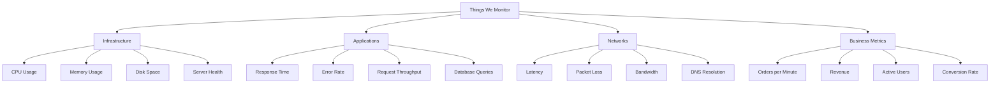
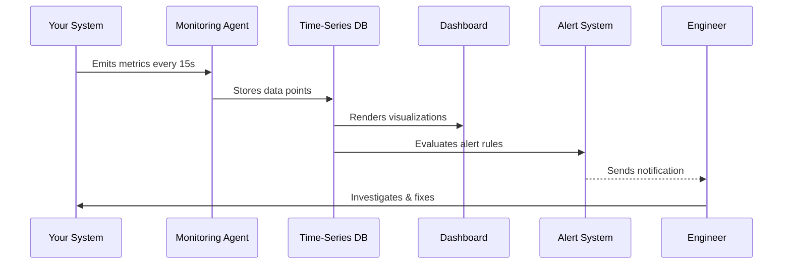

# What is Monitoring?

> *"You can't manage what you can't measure."* — Peter Drucker

---

## The Simple Explanation

Imagine you own a bakery. Every morning, you check:
- How much flour do you have?
- Is the oven temperature correct?
- How many customers are waiting?
- Are any machines broken?

This is **monitoring**. You're watching the health and performance of your business in real time so you can act before problems become disasters.

**Software monitoring is the same idea** — but instead of an oven, you're watching servers, databases, APIs, and applications.

---

## Technical Definition

**Monitoring** is the continuous process of:
1. **Collecting** data about a system's behavior and performance
2. **Storing** that data for current and historical analysis
3. **Visualizing** the data in dashboards and charts
4. **Alerting** when something goes wrong or a threshold is crossed
5. **Analyzing** trends to predict and prevent future problems

---

## What Gets Monitored?



---

## Real-World Analogy: A Car Dashboard

Your car has a built-in monitoring system:

| Car Indicator | Software Equivalent |
|---------------|-------------------|
| Speedometer | Request rate (requests/sec) |
| Fuel gauge | Available memory |
| Engine temperature | CPU usage |
| Oil warning light | Alert when threshold exceeded |
| Check engine light | Application error alert |
| Odometer | Total requests served |

When your car's oil warning light comes on, you don't panic — you have enough information to understand the problem and act. That's exactly what good monitoring gives you.

---

## The Monitoring Workflow



---

## Types of Monitoring

### 1. Infrastructure Monitoring
Watching the health of your servers, VMs, containers, and networks.

**Example:** CPU usage on your web server exceeds 90% → alert fires → engineer scales up

### 2. Application Performance Monitoring (APM)
Watching how your application code performs.

**Example:** A specific API endpoint's response time degrades from 50ms to 3000ms → alert fires → engineer finds slow database query

### 3. Synthetic Monitoring
Simulating user actions to test availability.

**Example:** Every minute, a bot visits your homepage and checks it loads successfully

### 4. Real User Monitoring (RUM)
Collecting performance data from actual users' browsers.

**Example:** Discovering that users in Australia experience 5x slower page loads than users in the US

### 5. Log Monitoring
Watching application logs for errors and anomalies.

**Example:** Detecting 50 "out of memory" errors in 60 seconds → alert fires

### 6. Business Monitoring
Tracking KPIs and business metrics.

**Example:** Orders per minute drops to zero at 2 PM → payment system failure detected

---

## What Monitoring Is NOT

| Misconception | Reality |
|---------------|---------|
| "Monitoring is just dashboards" | Dashboards are one output; monitoring also includes alerting, trending, and analysis |
| "We only need monitoring when something breaks" | Monitoring prevents breaks; it's proactive, not reactive |
| "Monitoring is only for Ops/DevOps" | Developers use monitoring to debug; business uses it for KPIs |
| "Monitoring = Logging" | Logs are one data source; monitoring uses metrics, traces, events, and more |
| "Cloud providers monitor for us" | Cloud providers give infrastructure visibility; you must monitor your applications |

---

## A Day Without Monitoring

Here's what typically happens without proper monitoring:

```
9:00 AM  - Application starts responding slowly
9:30 AM  - First customer complaints arrive via support tickets
9:45 AM  - Support team escalates to engineering
10:00 AM - Engineers start investigating with no data
10:30 AM - Engineers find a memory leak via manual log inspection
11:00 AM - Fix deployed
11:15 AM - Site returns to normal

Total downtime: 2h 15min
Data loss: 90 minutes of user experience data for root cause analysis
Customer impact: Hundreds of frustrated users
Revenue loss: ~$10,000 for a medium e-commerce site
```

**With monitoring:**
```
9:00 AM  - Application starts responding slowly
9:02 AM  - Alert fires: "API p99 latency > 2s"
9:02 AM  - Dashboard shows memory usage climbing since 8:47 AM
9:05 AM  - Engineer deploys fix for identified memory leak
9:06 AM  - Site returns to normal

Total downtime: 6 minutes
Root cause data: Complete
Revenue loss: ~$400
```

---

## Case Study: The 2021 Facebook Outage

On October 4, 2021, Facebook, Instagram, and WhatsApp went down for **6 hours** affecting **3.5 billion users**.

**Root cause:** A BGP routing configuration change removed all Facebook's route announcements from the internet.

**Without good monitoring for the DNS and BGP layer:**
- It took 30+ minutes for engineers to even confirm the issue
- Internal tools (Facebook's own apps) couldn't function, slowing investigation
- Engineers had to physically drive to data centers because remote access was down

**Estimated revenue loss:** ~$100 million

**Lesson:** Even the world's most sophisticated engineering teams need robust, independent monitoring infrastructure.

---

## Key Takeaways

- ✅ Monitoring is **continuous** — it runs 24/7/365
- ✅ Monitoring is **proactive** — it warns you before users complain
- ✅ Monitoring covers **infrastructure, applications, networks, and business metrics**
- ✅ Good monitoring dramatically **reduces downtime and cost**
- ✅ Monitoring is **for everyone** — DevOps, SRE, developers, and business teams

---

## 🔬 Lab Exercise

Before moving on, think about a system you use daily (your phone, a website, an app):

1. What metrics would you want to monitor?
2. What would be a critical threshold that requires an alert?
3. Who should be notified when that threshold is crossed?

Write your answers — we'll revisit them as your monitoring knowledge grows.

---

[← Back to Section Index](README.md) | [Next: Why Monitoring Matters →](02-why-monitoring-matters.md)
