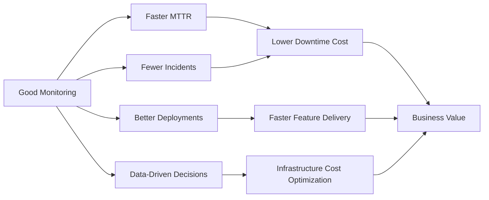

# Why Monitoring Matters

---

## The Cost of Downtime

Downtime is expensive. Not as an abstract concept — as cold, hard, calculated money.

### Industry Downtime Cost Benchmarks

| Industry | Average Cost Per Hour of Downtime |
|----------|----------------------------------|
| E-commerce (large) | $1,100,000 |
| Financial Services | $1,800,000 |
| Healthcare | $636,000 |
| Media & Entertainment | $90,000 |
| Retail (mid-size) | $46,000 |
| SaaS Applications | $300,000 |

*Source: Gartner, IDC, Ponemon Institute research*

### Formula: Calculate Your Downtime Cost

```
Hourly Downtime Cost = 
  (Revenue per hour) +
  (Productivity loss per hour) +
  (Recovery cost per hour) +
  (Reputation/customer churn cost)
```

**Example for a $10M/year SaaS company:**
```
Annual revenue:        $10,000,000
Hourly revenue:        $10,000,000 / 8760 = ~$1,140/hour
Productivity loss:     5 engineers × $150/hour = $750/hour
Recovery costs:        On-call premium + tools = $500/hour
Customer churn est:    $2,000/hour (lost contract risk)

Total hourly cost:     ~$4,390/hour
```

---

## Real Incidents: What Happens Without Monitoring

### Case Study 1: Knight Capital Group (2012)

**What happened:** A trading software bug deployed without proper monitoring caused $440 million in losses in **45 minutes**.

**How monitoring could have helped:**
- Abnormal trade volume alerts would have triggered in the first minute
- Financial threshold alerts could have halted trading automatically
- Real-time dashboards would have made the anomaly immediately visible

**Result:** The company was destroyed. Knight Capital no longer exists.

---

### Case Study 2: AWS US-East-1 Outage (December 2021)

**What happened:** A power issue cascaded into a 5-hour outage affecting Netflix, Disney+, Duolingo, and thousands of other services.

**How monitoring helped (in this case):**
- AWS's own monitoring detected the cascade within 3 minutes
- Status page updates (driven by monitoring) kept customers informed
- Automated runbooks triggered based on monitoring alerts

**What was missing:**
- Many companies relying on AWS did not have monitoring that could distinguish "is AWS down?" from "is my app down?" — leading to wasted engineering hours debugging their own code.

---

### Case Study 3: Healthcare System Data Loss (Anonymized)

**What happened:** A hospital's database backup process silently failed for 3 months due to a disk full error. No one noticed because no one was monitoring backup job success/failure.

**Discovery:** When disaster struck (hardware failure), the most recent working backup was 3 months old.

**Impact:** Months of patient records lost. HIPAA violation. Multi-million dollar settlement.

**How monitoring would have helped:**
- Backup job completion monitoring
- Disk space threshold alerts (e.g., alert at 80%, critical at 90%)
- Backup file size trending (sudden drop = problem)

---

## The Business Case for Monitoring

### Why Engineering Leaders Should Care



### ROI Calculation

**Investment:** A proper monitoring stack (Grafana + Prometheus) costs:
- Cloud hosting: ~$50-200/month
- Engineering time to set up: ~40 hours (one-time)
- Ongoing maintenance: ~5 hours/month

**Return:**
- Even preventing **one** 4-hour outage per year on a mid-size application saves: $4,390/hour × 4 hours = **$17,560**
- That's **87x return on investment** in the first incident prevented

---

## Why Teams Need Monitoring: Different Perspectives

### The Developer's Perspective

> *"I deployed my code. Is it working? How do I know?"*

Without monitoring, developers are **flying blind**. They deploy code and hope. With monitoring:

- See the exact moment a deployment causes errors
- Understand which API calls are slow and why
- Debug production issues with real data instead of guessing
- Validate that a performance optimization actually improved things

### The Operations Engineer's Perspective

> *"I'm on call at 3 AM and the page just fired. What do I do?"*

Monitoring is the difference between:
- **Without:** Frantically SSH-ing into 20 servers trying to find what's wrong
- **With:** Opening a dashboard that immediately shows the problematic service and the relevant metrics

### The CTO's Perspective

> *"Are we meeting our SLAs? Where should we invest in infrastructure?"*

Monitoring enables:
- Objective SLA compliance reporting
- Evidence-based infrastructure investment decisions
- Trend analysis to predict capacity needs before they become problems

### The Customer's Perspective

Customers don't think about monitoring — they just want things to work. Good monitoring means:
- Problems are found and fixed **before** customers notice
- When problems happen, they're resolved faster
- Service reliability becomes a competitive advantage

---

## The Hidden Benefits of Monitoring

Beyond incident response, monitoring provides:

### 1. Capacity Planning
```
"Our database is at 70% capacity. Based on current growth rate,
we'll hit 90% in 47 days. We should plan an upgrade."
```
This kind of prediction is only possible with historical monitoring data.

### 2. Performance Optimization
```
"Over the last 30 days, the /api/search endpoint averages 800ms.
The homepage averages 95ms. Something specific to search is slow."
```

### 3. Cost Optimization
```
"Our servers are at 15% average CPU utilization. We're paying for
4x the compute we actually need. Let's right-size."
```

### 4. Compliance and Auditing
Many industries require evidence of uptime and data processing. Monitoring provides:
- Uptime reports for SLA compliance
- Audit trails for regulatory requirements
- Security monitoring for breach detection

### 5. Developer Confidence
When monitoring is in place, teams deploy more frequently because they can:
- See immediately if a deployment goes wrong
- Roll back based on concrete data, not feelings
- Validate changes with real production metrics

---

## The Monitoring Maturity Model

Where is your organization on the monitoring journey?

```
Level 0 — No Monitoring
  ❌ No visibility. Problems discovered by users.
  
Level 1 — Reactive Monitoring  
  ✅ Basic uptime checks
  ✅ Manual log review
  ❌ No trending, no alerts for performance
  
Level 2 — Proactive Monitoring
  ✅ System metrics collected
  ✅ Basic dashboards
  ✅ Threshold-based alerting
  ❌ No application-level visibility
  
Level 3 — Comprehensive Monitoring
  ✅ Infrastructure + Application metrics
  ✅ Centralized logs
  ✅ Intelligent alerting (anomaly detection)
  ✅ SLO tracking
  
Level 4 — Observability
  ✅ Metrics + Logs + Traces correlated
  ✅ Automatic anomaly detection
  ✅ Business metrics tied to technical metrics
  ✅ Continuous improvement driven by data
```

Most organizations start at Level 0 or 1. This material will take you to Level 3.

---

## Key Takeaways

- ✅ Downtime is expensive — even small applications can lose thousands per hour
- ✅ Most major incidents could have been detected and resolved faster with monitoring
- ✅ Monitoring benefits everyone: developers, ops, engineering leaders, and customers
- ✅ The ROI on monitoring investment is typically 50-100x in the first year
- ✅ Monitoring enables capacity planning, cost optimization, and faster deployments

---

[← What is Monitoring?](01-what-is-monitoring.md) | [Next: History of Monitoring →](03-history-of-monitoring.md)
