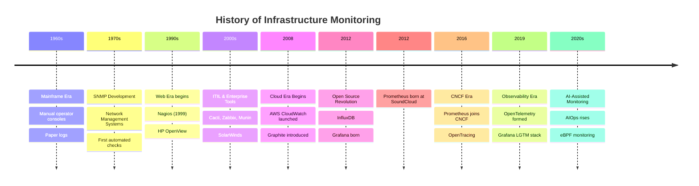

# History of Monitoring

> Understanding how we got here helps you understand why tools work the way they do.

---

## The Evolution of Monitoring



---

## Era 1: The Mainframe Age (1960s–1980s)

In the early days of computing, monitoring was entirely **manual**.

**How it worked:**
- Computer operators sat in front of large consoles watching blinking lights
- Paper logs recorded system events
- If a light indicated a problem, an operator physically intervened
- "On-call" meant sleeping in the computer room

**Limitations:**
- 100% human-dependent
- No trend analysis
- No automated alerting
- Monitoring and operations were the same job

**Tools of the era:**
- Console panels with indicator lights
- Paper audit logs
- IBM System Management Facilities (SMF) — one of the first automated log systems

---

## Era 2: The Network Management Era (1980s–1990s)

As networks grew, manual monitoring became impossible. The industry developed standards.

### SNMP: Simple Network Management Protocol (1988)

SNMP was revolutionary — it allowed software to **automatically query** network devices for their status.

```
Network Manager → sends SNMP GET → Router
Router → responds with: "CPU: 45%, Interfaces: UP, Errors: 0"
```

**SNMP still exists today** and is used in enterprise networking. Many modern exporters translate SNMP data into Prometheus metrics.

### Early Monitoring Systems

| Tool | Year | Focus |
|------|------|-------|
| HP OpenView | 1988 | Enterprise network management |
| IBM Tivoli | 1989 | Enterprise IT management |
| MRTG | 1994 | Network traffic graphing |
| Nagios | 1999 | Open-source server monitoring |

### Nagios: The First Open-Source Monitoring Standard

Nagios (originally NetSaint) was released in 1999 and became the dominant open-source monitoring tool for a decade.

**How Nagios worked:**
```bash
# Nagios check: Is the HTTP server responding?
check_http -H myserver.com -p 80
# Returns: HTTP OK - Status line output matched "200 OK"
```

**Nagios's legacy:**
- Defined the concept of "checks" and "services"
- Created the alert → acknowledgment → escalation workflow
- Still used by thousands of organizations today
- Spawned forks: Icinga, Naemon, Shinken

---

## Era 3: The Web Scale Era (2000s)

As the internet exploded, traditional monitoring tools struggled to keep up.

**Problems with the old approach:**
- Nagios was check-based (pass/fail) — not metric-based
- No trending or capacity planning
- Didn't scale to thousands of hosts
- No developer-friendly APIs

### New Tools Emerge

| Tool | Year | Innovation |
|------|------|-----------|
| Cacti | 2001 | RRDTool-based graphing |
| Munin | 2004 | Automatic graphing with plugins |
| Zabbix | 2004 | Enterprise-grade open source |
| Ganglia | 2000 | High-performance cluster monitoring |
| Graphite | 2006 | Time-series metrics at scale |

### Graphite: The First Modern Metrics System

Graphite (2006) was a breakthrough because it introduced:
- A **simple plaintext protocol** for sending metrics
- A **time-series database** (Whisper) for storing metrics
- A **web interface** for graphing
- The concept of **metric paths**: `servers.web01.cpu.usage`

```bash
# Sending a metric to Graphite — still used today!
echo "servers.web01.cpu.usage 85 $(date +%s)" | nc graphite.example.com 2003
```

This "push metrics to a central store" concept influenced all future monitoring systems.

---

## Era 4: The Cloud-Native Era (2010s)

Cloud computing changed everything. Suddenly:
- Infrastructure was **ephemeral** (servers come and go)
- Scale went from tens of servers to **thousands**
- Microservices meant **hundreds of components** to monitor
- Container orchestration (Kubernetes) made hosts meaningless

Traditional monitoring broke completely.

### The Problem

```
Old model: "Monitor server web01.example.com on port 80"
New problem: "Monitor a container that runs for 10 minutes, 
             in a pod that gets scheduled on different nodes,
             as one of 200 replicas"
```

Nagios couldn't handle this. You couldn't hardcode container names.

### SoundCloud's Problem (2012)

SoundCloud was an early adopter of microservices. By 2012, they had:
- Hundreds of microservices
- Thousands of dynamic instances
- No suitable monitoring tool

Their engineers — **Julius Volz and Björn Rabenstein** — decided to build their own. They called it **Prometheus**.

---

## Era 5: Prometheus and Grafana (2012–Present)

### Prometheus (2012)

Prometheus solved the dynamic infrastructure problem with a radical idea: **pull-based monitoring with labels**.

```yaml
# Instead of: "monitor web01 on port 9090"
# Prometheus does: "discover all services labeled 'job=web' and scrape them"

scrape_configs:
  - job_name: 'web-services'
    kubernetes_sd_configs:
      - role: pod
    relabel_configs:
      - source_labels: [__meta_kubernetes_pod_label_app]
        regex: web.*
        action: keep
```

**Key innovations:**
- Pull-based model (Prometheus fetches metrics, not the other way around)
- Multi-dimensional labels (not just host-based)
- Powerful query language (PromQL)
- Built-in service discovery

Prometheus was open-sourced in 2012 and joined the **Cloud Native Computing Foundation (CNCF)** in 2016 — the same foundation that hosts Kubernetes.

### Grafana (2013)

**Torkel Ödegaard** started Grafana as a fork of Kibana (the ELK Stack dashboard). His goal was a **beautiful, flexible, data-source-agnostic** dashboard tool.

First version: A JavaScript dashboard that could query Graphite and Elasticsearch.

Over time, Grafana added support for:
- Prometheus (2015)
- InfluxDB
- Loki (their own log aggregation system)
- Tempo (their own distributed tracing system)
- 150+ data sources today

**Grafana's key insight:** Users shouldn't need to switch tools for different data types. One dashboard for everything.

---

## Era 6: The Observability Era (2019–Present)

Monitoring evolved into **observability** — a broader concept that asks not just "is it down?" but "why is it behaving this way?"

### OpenTelemetry (2019)

OpenTelemetry merged two competing standards (OpenTracing + OpenCensus) into a single, vendor-neutral framework for:
- Metrics
- Logs
- Traces

This enabled the "three pillars of observability" to be collected consistently and sent to any backend.

### The LGTM Stack

Grafana Labs created a complete observability stack:

| Component | Purpose | Prometheus Alternative |
|-----------|---------|----------------------|
| **L**oki | Log aggregation | ELK Stack |
| **G**rafana | Visualization | — |
| **T**empo | Distributed tracing | Jaeger |
| **M**imir | Long-term Prometheus metrics storage | Thanos |

---

## Timeline: Key Prometheus & Grafana Milestones

| Year | Event |
|------|-------|
| 2012 | Prometheus created at SoundCloud |
| 2013 | Grafana v0.1 released |
| 2016 | Prometheus joins CNCF as second project (after Kubernetes) |
| 2016 | Grafana 3.0 with plugin system |
| 2018 | Grafana 5.0 — modern UI |
| 2018 | Prometheus 2.0 — new TSDB engine |
| 2019 | Grafana Labs raises $24M Series A |
| 2019 | Loki released for log aggregation |
| 2020 | Grafana 7.0 — transforms and panel library |
| 2021 | Grafana Labs raises $220M, valued at $3B |
| 2021 | Mimir announced for scalable Prometheus |
| 2022 | Grafana 9.0 — unified alerting |
| 2023 | Grafana 10.0 — major redesign |
| 2024 | Grafana and Prometheus remain top CNCF projects by adoption |

---

## Key Takeaways

- ✅ Monitoring started as manual, labor-intensive work
- ✅ SNMP and Nagios defined early automated monitoring patterns
- ✅ Cloud and containers broke traditional monitoring tools
- ✅ Prometheus solved dynamic infrastructure monitoring with labels and pull-based scraping
- ✅ Grafana unified visualization across all data sources
- ✅ The field is evolving toward full observability (metrics + logs + traces)

---

[← Why Monitoring Matters](02-why-monitoring-matters.md) | [Next: Monitoring vs Observability →](04-monitoring-vs-observability.md)
