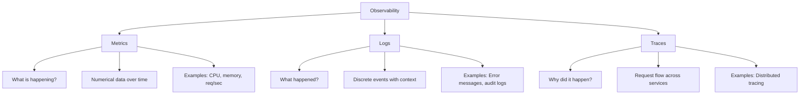

# Monitoring vs Observability

> One of the most debated topics in modern DevOps. Let's cut through the confusion.

---

## The Short Answer

| | Monitoring | Observability |
|--|-----------|---------------|
| **Question answered** | "Is it broken?" | "Why is it broken?" |
| **Approach** | Predefined checks | Exploratory investigation |
| **Data** | Known failure modes | Any behavior |
| **Metaphor** | Smoke alarm | Full forensics lab |

---

## The Long Answer

### Monitoring

Monitoring is about **watching for known problems**. You define in advance what matters, collect that data, and alert when thresholds are crossed.

```
You know: "If CPU > 90%, something is wrong"
You define: Alert rule for CPU > 90%
You collect: CPU metrics every 15 seconds
You get: Alert when CPU hits 95%
```

The limitation: **you can only find problems you anticipated**.

If an unknown bug causes CPU to stay at 50% but causes database connections to leak slowly, a CPU alert won't catch it.

### Observability

Observability (from control systems theory) is about how well you can **infer the internal state** of a system from its external outputs.

A system is "observable" if you can answer arbitrary questions about its behavior — even questions you didn't think to ask beforehand.

```
You notice: Users in Germany are complaining about slow checkout
You ask: "What's different about requests from Germany vs US?"
You discover: German users route through a CDN node with high latency
You fix: CDN configuration
```

You didn't define a "Germany latency" alert. But because your system was observable (you had rich metrics with geographic labels), you could investigate ad-hoc.

---

## The Three Pillars of Observability



### Metrics (Monitoring's Primary Tool)
- Numerical values collected over time
- Great for dashboards and alerting
- Low storage cost, fast to query
- **Limited:** Can't explain the "why"

### Logs (Troubleshooting's Best Friend)
- Detailed records of discrete events
- Great for debugging specific issues
- High storage cost
- **Limited:** Hard to aggregate at scale

### Traces (Distributed Systems' Superpower)
- Track a single request through multiple services
- Show exactly where time is spent
- Moderate storage cost
- **Limited:** Complex to implement

---

## A Practical Example: Slow Checkout

Let's say your e-commerce checkout takes 8 seconds instead of 1 second.

### With Monitoring Only

```
Alert: "checkout_latency_p99 > 5s"
You know: Checkout is slow
You don't know: Which part? Database? API? Third-party payment? Network?
Next step: Manual investigation — SSH to servers, read logs manually
Time to resolution: 2+ hours
```

### With Observability

```
Alert: "checkout_latency_p99 > 5s"
Metric dashboard shows: Spike started at 14:32
Trace for a slow request shows:
  - Frontend: 12ms ✅
  - Auth service: 18ms ✅
  - Cart service: 23ms ✅
  - Payment gateway call: 7,821ms ❌ ← Found it!
Log for payment service shows:
  ERROR: Payment gateway timeout after 7800ms
  (Payment provider is having an outage)
Time to resolution: 5 minutes
```

---

## Monitoring is a Subset of Observability

```
┌─────────────────────────────────────────────┐
│                 OBSERVABILITY               │
│                                             │
│   ┌─────────────────────────────────────┐   │
│   │           MONITORING                │   │
│   │   (Known failures, thresholds)      │   │
│   └─────────────────────────────────────┘   │
│                                             │
│   + Logs + Traces + Profiling + Events      │
│   + Ad-hoc investigation capability         │
│   + Unknown unknowns                        │
└─────────────────────────────────────────────┘
```

**All monitoring is observability. Not all observability is monitoring.**

---

## When Is Monitoring Enough?

Monitoring alone is sufficient for:
- Simple, well-understood systems
- Single-service applications
- Infrastructure-level issues (disk full, server down)
- Any problem you've seen before

You need full observability when:
- You have microservices (10+ services)
- Problems manifest as subtle performance degradation
- Root cause analysis takes more than 30 minutes
- You need to understand user-specific issues
- You're doing SRE practices with SLOs and error budgets

---

## Tools Comparison

| Capability | Prometheus/Grafana | Full Observability Stack |
|-----------|-------------------|--------------------------|
| Metrics | ✅ Excellent | ✅ Excellent |
| Alerting | ✅ Excellent | ✅ Excellent |
| Log aggregation | ⚠️ Via Loki add-on | ✅ Built-in |
| Distributed tracing | ❌ Requires Tempo | ✅ Built-in |
| Ad-hoc exploration | ⚠️ Limited | ✅ Excellent |
| Cost | 💚 Low (open source) | 💛 Medium to High |
| Complexity | 💚 Low to Medium | 💛 Medium to High |

---

## The Observability Spectrum in Practice

Most organizations don't start with full observability — they build toward it:

```
Stage 1: Basic Monitoring
  → Uptime checks, basic server metrics

Stage 2: Metrics Monitoring  
  → Prometheus + Grafana (what this repo covers!)

Stage 3: Log Aggregation
  → Add Loki or ELK Stack

Stage 4: Distributed Tracing
  → Add Jaeger, Tempo, or Zipkin

Stage 5: Full Observability
  → Correlate metrics + logs + traces
  → AIOps and anomaly detection
```

**This material focuses on Stage 2** — and gives you the foundation to reach Stages 3-5.

---

## Key Takeaways

- ✅ Monitoring answers "Is it broken?" — observability answers "Why is it broken?"
- ✅ Observability = Metrics + Logs + Traces (all three pillars)
- ✅ Monitoring is a subset of observability
- ✅ Prometheus + Grafana provides excellent metrics-based monitoring
- ✅ Start with monitoring, layer in logs and traces as your systems grow

---

[← History of Monitoring](03-history-of-monitoring.md) | [Next: Business Impact →](05-business-impact.md)
