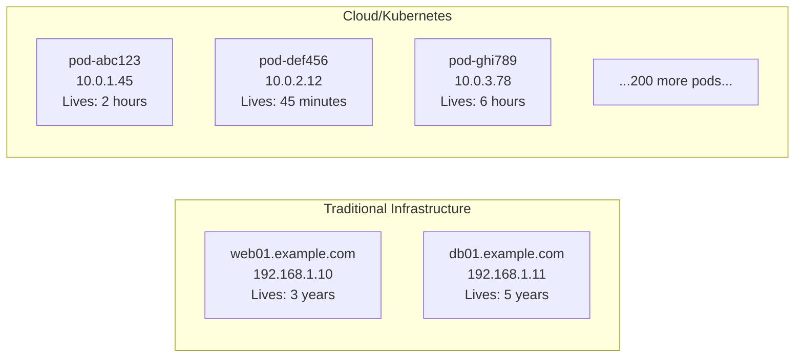
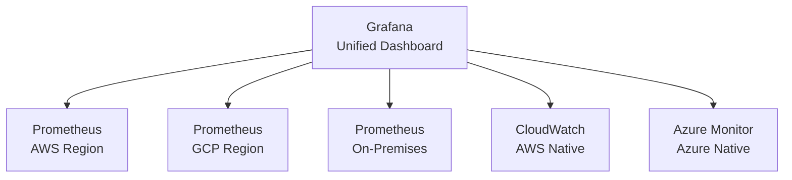
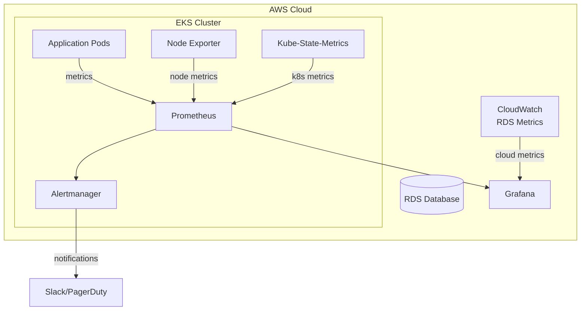
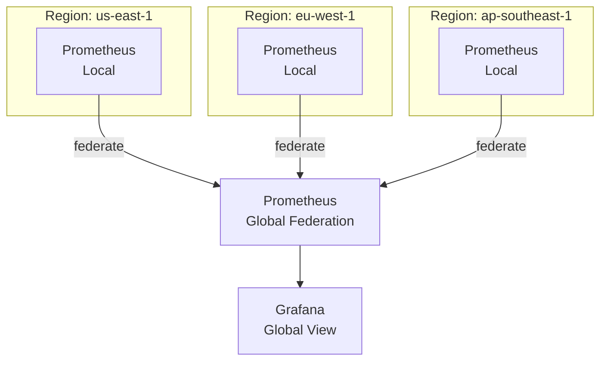

# Monitoring in Modern Cloud Environments

---

## How Cloud Changed Everything

Traditional monitoring assumed:
- Servers have fixed IP addresses
- Servers live for months or years
- The number of servers changes slowly
- You know what services run where

Cloud computing broke all these assumptions.



---

## Cloud Monitoring Challenges

### Challenge 1: Ephemeral Infrastructure

In Kubernetes, pods are created and destroyed constantly. Auto-scaling adds and removes instances based on load.

**Problem:** Traditional monitoring couldn't track moving targets.

**Prometheus solution:** Service discovery. Instead of listing servers manually, Prometheus automatically discovers all pods with specific labels.

```yaml
# Prometheus automatically finds all pods labeled "app=myservice"
scrape_configs:
  - job_name: 'myservice'
    kubernetes_sd_configs:
      - role: pod
    relabel_configs:
      - source_labels: [__meta_kubernetes_pod_label_app]
        regex: myservice
        action: keep
```

### Challenge 2: Scale

A large Kubernetes cluster might have:
- 500 nodes
- 5,000 pods
- 50,000 containers
- Millions of metrics

Traditional tools choked at this scale. Prometheus was built for it.

### Challenge 3: Multi-Cloud and Hybrid

Many organizations run:
- Production on AWS
- DR on GCP
- Legacy on-premises
- Development on Azure

Monitoring must span all environments with a unified view.



### Challenge 4: Shared Responsibility Model

In cloud environments, responsibility is split:

```
Cloud Provider Monitors:
  ✅ Physical hardware
  ✅ Network infrastructure
  ✅ Hypervisor
  ✅ Managed service internals (RDS, etc.)
  
YOU Must Monitor:
  ❌ Your applications
  ❌ Your containers
  ❌ Your business logic
  ❌ User experience
  ❌ Cross-service dependencies
```

Many teams assume the cloud provider monitors everything. They don't.

---

## Cloud-Native Monitoring Architecture

### Single Cloud Setup



### Multi-Region Setup with Federation



---

## Cloud Provider Native Monitoring Tools

Understanding how Prometheus/Grafana fits alongside native cloud tools:

### AWS

| Tool | Purpose | Use With Prometheus? |
|------|---------|---------------------|
| CloudWatch | AWS service metrics | Yes — Grafana CloudWatch datasource |
| X-Ray | Distributed tracing | Alongside (different use case) |
| GuardDuty | Security monitoring | Complementary |
| AWS Health | Service health events | Complementary |

### GCP

| Tool | Purpose |
|------|---------|
| Cloud Monitoring (Stackdriver) | GCP metrics |
| Cloud Trace | Distributed tracing |
| Cloud Logging | Centralized logging |

### Azure

| Tool | Purpose |
|------|---------|
| Azure Monitor | Azure metrics |
| Application Insights | APM |
| Log Analytics | Centralized logging |

**Best practice:** Use Prometheus for your own application and container metrics. Use cloud-native tools for managed service metrics (RDS, DynamoDB, etc.). Unify all in Grafana.

---

## Serverless Monitoring

Serverless adds even more complexity:

**Lambda/Cloud Functions challenges:**
- Functions run for milliseconds to minutes
- You can't install agents
- Billing is per-invocation
- Cold starts affect performance

**Solutions:**
```python
# Instrument your Lambda function with Prometheus-compatible metrics
import boto3
import time

def lambda_handler(event, context):
    start_time = time.time()
    
    # Your business logic here
    result = process_data(event)
    
    # Emit custom metric to CloudWatch (then pull into Grafana)
    cloudwatch = boto3.client('cloudwatch')
    cloudwatch.put_metric_data(
        Namespace='MyApp',
        MetricData=[{
            'MetricName': 'ProcessingDuration',
            'Value': (time.time() - start_time) * 1000,
            'Unit': 'Milliseconds'
        }]
    )
    
    return result
```

---

## Container and Kubernetes-Specific Considerations

### What to Monitor in Kubernetes

```
Cluster Level:
  - Node CPU, memory, disk
  - Pod count vs desired
  - etcd health
  - API server latency
  
Namespace Level:
  - Resource quotas and limits
  - Pod restart rates
  - PVC usage
  
Application Level:
  - Custom application metrics
  - HTTP error rates
  - Request latency
  - Queue depths
```

### The Kubernetes Monitoring Stack

The industry-standard Kubernetes monitoring setup:

```
kube-prometheus-stack (Helm chart) includes:
  ├── Prometheus Operator
  ├── Prometheus
  ├── Alertmanager  
  ├── Node Exporter (on every node)
  ├── Kube-State-Metrics
  ├── Grafana
  └── Default dashboards and alert rules
```

We'll deploy this in [Section 8 — Kubernetes](../../kubernetes/README.md).

---

## Key Takeaways

- ✅ Cloud environments (ephemeral IPs, auto-scaling, containers) broke traditional monitoring
- ✅ Prometheus's pull model and service discovery solve cloud-native monitoring
- ✅ Use Prometheus for your apps + cloud-native tools for managed services + Grafana to unify
- ✅ Kubernetes monitoring requires specialized exporters (Node Exporter, kube-state-metrics)
- ✅ The shared responsibility model means you must monitor your own applications

---

[← Business Impact](05-business-impact.md) | [Next: Monitoring for DevOps →](07-monitoring-for-devops.md)
