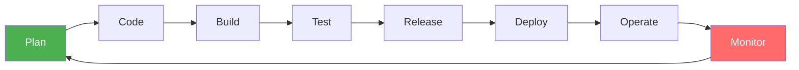
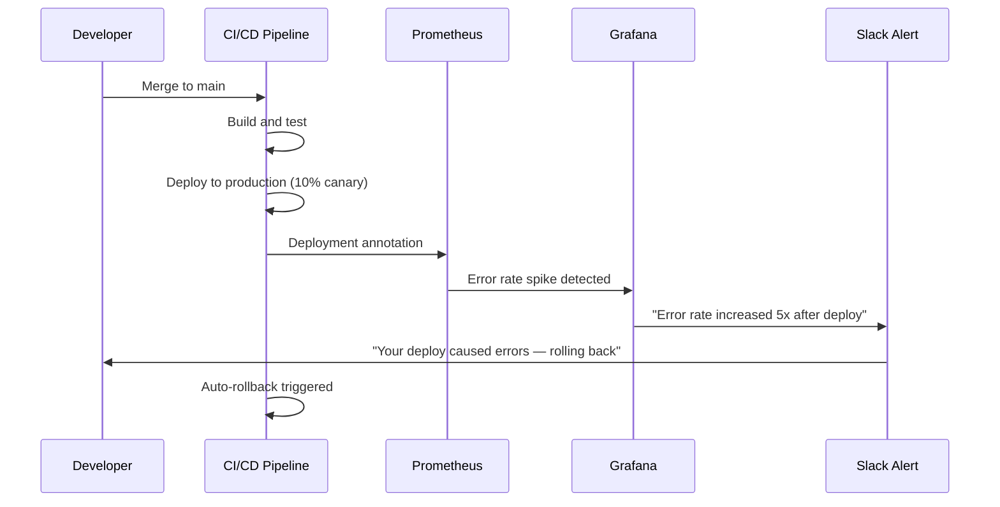
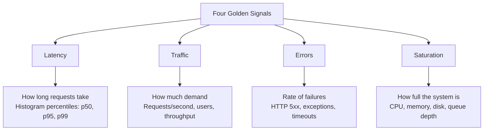

# Monitoring for DevOps Teams

---

## DevOps and Monitoring: Inseparable Partners

DevOps is about breaking down silos between development and operations to deliver software faster and more reliably. Monitoring is the feedback loop that makes this possible.



The DevOps infinity loop only works if **monitoring feeds back into planning**. Without monitoring, the loop is broken.

---

## DevOps Use Cases for Monitoring

### 1. Deployment Monitoring (Most Critical)

Every deployment is a potential source of problems. Monitoring tells you immediately if a deployment broke something.

**The Deployment Verification Flow:**



**Key metrics to watch during deployment:**
```promql
# Error rate — should stay below 1%
rate(http_requests_total{status=~"5.."}[5m]) 
/ rate(http_requests_total[5m])

# Latency — should stay below SLO
histogram_quantile(0.99, rate(http_request_duration_seconds_bucket[5m]))

# Request rate — should be normal (not dropping to zero!)
rate(http_requests_total[5m])
```

### 2. Canary Deployments

Progressive delivery requires monitoring to know when to proceed or rollback.

```
Deploy v2.0 to 5% of traffic
  ↓
Monitor: Error rate v1.0 vs v2.0
         Latency v1.0 vs v2.0
         Success rate v1.0 vs v2.0
  ↓
v2.0 metrics ≤ v1.0 metrics?
  YES → Increase to 25% → 50% → 100%
  NO  → Rollback immediately
```

### 3. CI/CD Pipeline Monitoring

Not just the deployed application — the pipeline itself needs monitoring.

**Pipeline metrics to track:**
- Build success/failure rate
- Build duration trends
- Test suite execution time
- Deployment frequency (DORA metric)
- Change failure rate (DORA metric)

### 4. Blue-Green Deployment Verification

```
Blue environment: v1.0 (currently live)
Green environment: v2.0 (new version)
  ↓
Deploy to Green, run smoke tests
  ↓
Compare Grafana dashboards:
  - Blue: error_rate=0.1%, latency_p99=45ms
  - Green: error_rate=0.08%, latency_p99=42ms (better!)
  ↓
Switch traffic to Green
Monitor transition period
```

---

## Infrastructure as Code + Monitoring as Code

DevOps teams treat infrastructure as code — monitoring should be no different.

### Monitoring as Code with Grafana and Prometheus

```yaml
# prometheus/alert_rules.yml — version controlled
groups:
  - name: deployment_alerts
    rules:
      - alert: HighErrorRateAfterDeploy
        expr: |
          rate(http_requests_total{status=~"5.."}[5m]) 
          / rate(http_requests_total[5m]) > 0.01
        for: 2m
        labels:
          severity: critical
        annotations:
          summary: "Error rate {{ $value | humanizePercentage }} after deploy"
          runbook: "https://wiki.example.com/runbooks/high-error-rate"
```

```yaml
# grafana/dashboards/deployment.json — version controlled
# Export dashboards from Grafana UI and store in Git
# Use Grafana provisioning to automatically load dashboards
```

### Grafana Provisioning (Auto-loading dashboards from Git)

```yaml
# grafana/provisioning/dashboards/default.yml
apiVersion: 1
providers:
  - name: 'default'
    type: file
    options:
      path: /etc/grafana/dashboards
      foldersFromFilesStructure: true
```

---

## The DevOps Golden Signals

The "Four Golden Signals" (from Google SRE book) are the minimum metrics every DevOps team should monitor:



**PromQL for the Four Golden Signals:**

```promql
# Latency (p99 response time)
histogram_quantile(0.99, 
  rate(http_request_duration_seconds_bucket[5m]))

# Traffic (requests per second)
rate(http_requests_total[5m])

# Errors (error rate %)
rate(http_requests_total{status=~"5.."}[5m]) 
/ rate(http_requests_total[5m]) * 100

# Saturation (CPU usage %)
100 - (avg(rate(node_cpu_seconds_total{mode="idle"}[5m])) * 100)
```

---

## Shift-Left Monitoring

"Shift left" means moving processes earlier in the development lifecycle. Shift-left monitoring means developers see monitoring data, not just ops.

### Developer Dashboards

Each development team should have their own Grafana dashboard showing:
- Their service's error rate
- Their service's latency
- Their service's resource usage
- Downstream dependency health

### Local Development Monitoring

Even in development, use monitoring:

```yaml
# docker-compose.yml for local dev
services:
  myapp:
    image: myapp:dev
    ports:
      - "8080:8080"
  
  prometheus:
    image: prom/prometheus
    volumes:
      - ./prometheus.yml:/etc/prometheus/prometheus.yml
  
  grafana:
    image: grafana/grafana
    ports:
      - "3000:3000"
```

Developers can then see their local service's metrics while coding.

---

## Runbooks and Monitoring Integration

Every alert should have a runbook — a documented procedure for responding to it.

**Example Runbook:**

```markdown
# Runbook: HighCPUUsage

## Alert
`node_cpu_usage > 90%` for 5 minutes

## Impact
Services on this node may be slow or unresponsive

## Immediate Actions
1. Check Grafana: http://grafana.example.com/d/cpu-dashboard
2. Identify top CPU consumers:
   \`\`\`bash
   kubectl top pods --sort-by=cpu
   \`\`\`
3. If a specific pod: check logs
   \`\`\`bash
   kubectl logs <pod-name> --previous
   \`\`\`

## If CPU is from application bug
- Roll back the last deployment
- See: your team's rollback procedure runbook

## If CPU is from traffic spike
- Scale deployment:
  \`\`\`bash
  kubectl scale deployment myapp --replicas=10
  \`\`\`

## Escalation
If unresolved in 15 minutes, page the on-call lead.
```

---

## Key DevOps Monitoring Practices

| Practice | Description | Tool |
|----------|-------------|------|
| Deploy annotations | Mark deployments on graphs | Grafana annotations |
| Automated rollback | Roll back if metrics degrade | Argo Rollouts + Prometheus |
| Feature flag monitoring | Track metric impact of feature flags | Grafana + Prometheus |
| Load test dashboards | Monitor during load tests | k6 + Grafana |
| Capacity planning | Plan infrastructure from trends | Prometheus + Grafana |

---

## Key Takeaways

- ✅ Monitoring is the feedback loop in the DevOps infinity loop
- ✅ Every deployment should be monitored — errors, latency, traffic
- ✅ Treat monitoring configuration as code — store in Git
- ✅ The Four Golden Signals (Latency, Traffic, Errors, Saturation) are your minimum baseline
- ✅ Shift-left monitoring means developers engage with metrics, not just ops

---

[← Monitoring in Cloud](06-monitoring-in-cloud.md) | [Next: Monitoring for SRE →](08-monitoring-for-sre.md)
