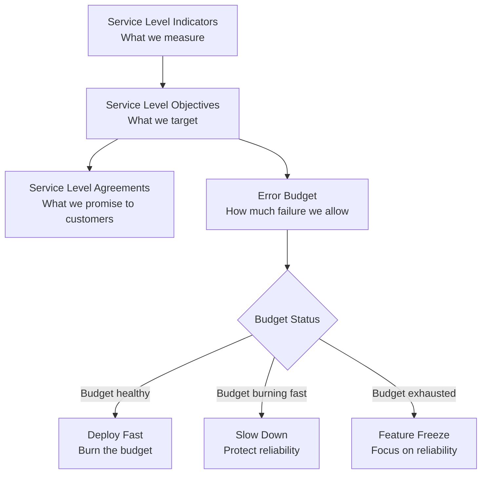
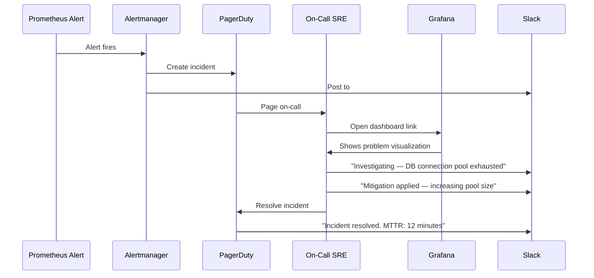

# Monitoring for SRE Teams

---

## What is SRE?

Site Reliability Engineering (SRE) was invented at Google in 2003 by Ben Treynor Sloss. The core idea:

> *"SRE is what happens when you ask a software engineer to design an operations function."*

SREs apply software engineering principles to operations problems. Monitoring is the most important tool in their arsenal.

---

## The SRE Reliability Stack



### SLI — Service Level Indicator
A **quantitative measure** of your service's behavior.

Examples:
- Percentage of HTTP requests completing in < 200ms
- Percentage of requests returning non-5xx responses
- Percentage of time the service is reachable

### SLO — Service Level Objective
A **target value** for an SLI.

Examples:
- 99.9% of requests complete in < 200ms
- 99.95% of requests return non-5xx responses
- Service is reachable 99.99% of the time

### SLA — Service Level Agreement
A **contractual promise** to customers, usually with financial penalties.

### Error Budget
The amount of downtime/errors you're **allowed** based on your SLO.

```
SLO: 99.9% availability over 30 days
Error budget: 0.1% × 30 days × 24 hours × 60 minutes = 43.2 minutes
```

---

## SRE Monitoring with Prometheus and Grafana

### Defining SLIs in PromQL

```promql
# SLI: Availability (fraction of successful requests)
sum(rate(http_requests_total{status!~"5.."}[5m]))
/
sum(rate(http_requests_total[5m]))

# SLI: Latency (fraction of requests under 200ms)
sum(rate(http_request_duration_seconds_bucket{le="0.2"}[5m]))
/
sum(rate(http_request_duration_seconds_count[5m]))
```

### Error Budget Tracking

```promql
# Error budget consumed (last 30 days)
1 - (
  sum_over_time(
    (sum(rate(http_requests_total{status!~"5.."}[5m])) 
     / sum(rate(http_requests_total[5m])))[30d:5m]
  ) / (30 * 24 * 12)  -- number of 5-minute windows in 30 days
)
```

### Error Budget Burn Rate Alerts (Google SRE Book Method)

This is the most important SRE alert concept:

```yaml
# Alert when you're burning through error budget too fast
groups:
  - name: slo-alerts
    rules:
      # Burn rate 14.4x: Budget exhausted in 1 hour
      - alert: HighErrorBudgetBurn
        expr: |
          (
            rate(http_requests_total{status=~"5.."}[5m])
            / rate(http_requests_total[5m])
          ) > (14.4 * 0.001)   # 14.4x burn rate of 0.1% error budget
        for: 2m
        labels:
          severity: critical
          page: "yes"
        annotations:
          summary: "Error budget burning at 14.4x rate — exhausted in 1 hour"
      
      # Burn rate 6x: Budget exhausted in 1 day
      - alert: MediumErrorBudgetBurn
        expr: |
          (
            rate(http_requests_total{status=~"5.."}[30m])
            / rate(http_requests_total[30m])
          ) > (6 * 0.001)
        for: 15m
        labels:
          severity: warning
        annotations:
          summary: "Error budget burning at 6x rate — exhausted in 1 day"
```

---

## MTTR and MTTD in SRE Practice

### MTTD — Mean Time to Detect

How long from when a problem starts until you know about it?

```
Without monitoring: Users report issues → support escalates → ops investigates
MTTD: 20-60 minutes

With Prometheus alerts: Problem starts → alert fires
MTTD: 1-5 minutes
```

**Impact:** Every minute of MTTD reduction directly reduces customer impact.

### MTTR — Mean Time to Recover

How long from detection to resolution?

```
Factors affecting MTTR:
  - Alert quality (does the alert tell you what's wrong?)
  - Dashboard quality (does the dashboard show you why?)
  - Runbook quality (does the runbook guide resolution?)
  - Access and tooling (can you act on what you see?)
```

**SRE Goal:** Drive MTTD < 5 minutes, MTTR < 30 minutes

---

## Toil: The SRE Enemy Monitoring Solves

Google defines **toil** as manual, repetitive operational work. SREs aim to keep toil below 50% of their time.

Monitoring reduces toil by:
- **Automating detection** (no more manual health checks)
- **Automating diagnosis** (dashboards replace manual investigation)
- **Enabling auto-remediation** (triggered by monitoring alerts)

### Auto-Remediation Example

```yaml
# Prometheus alert → Alertmanager webhook → auto-remediation script
# When pod memory > 90%, automatically restart it

- alert: PodHighMemory
  expr: container_memory_usage_bytes / container_spec_memory_limit_bytes > 0.9
  for: 5m
  annotations:
    action: "restart_pod"
    namespace: "{{ $labels.namespace }}"
    pod: "{{ $labels.pod }}"
```

```python
# Alertmanager webhook receiver
@app.route('/webhook', methods=['POST'])
def auto_remediate():
    alert = request.json
    if alert['labels']['action'] == 'restart_pod':
        k8s.delete_pod(
            namespace=alert['labels']['namespace'],
            name=alert['labels']['pod']
        )
    return "OK"
```

---

## The SRE On-Call Dashboard

Every SRE on-call shift should start with a 5-minute "state of the world" check.

**Essential SRE Dashboard panels:**

1. **SLO Burn Rate (last 1h, 6h, 24h)** — is anything trending toward exhausting budget?
2. **Active Alerts** — what's currently firing?
3. **Error Rate by Service** — which services have elevated errors?
4. **Latency p99 by Service** — which services are slow?
5. **Recent Deployments** — what changed in the last 4 hours?
6. **Infrastructure Health** — any nodes down, disk full, etc.?

---

## Runbooks Integration with Grafana

Modern Grafana supports linking dashboards to runbooks:

```json
{
  "annotations": {
    "runbook_url": "https://wiki.example.com/runbooks/high-latency"
  }
}
```

Alert rules can also include runbook links:

```yaml
- alert: HighLatency
  expr: histogram_quantile(0.99, ...) > 1.0
  annotations:
    summary: "API latency p99 above 1s"
    runbook_url: "https://wiki.example.com/runbooks/high-latency"
    dashboard_url: "https://grafana.example.com/d/api-latency"
```

When an SRE receives a PagerDuty alert, they click the runbook link and dashboard link — everything they need is one click away.

---

## Incident Management Integration



---

## Key Takeaways

- ✅ SREs use SLIs, SLOs, and error budgets to quantify and manage reliability
- ✅ Error budget burn rate alerts are the most actionable SRE alerts
- ✅ Good monitoring drives MTTD < 5 minutes and MTTR < 30 minutes
- ✅ Monitoring reduces toil — manual, repetitive ops work
- ✅ SRE dashboards should always show SLO status, error rates, and recent deployments

---

[← Monitoring for DevOps](07-monitoring-for-devops.md) | [Next: Monitoring for Platform Engineering →](09-monitoring-for-platform-engineering.md)
