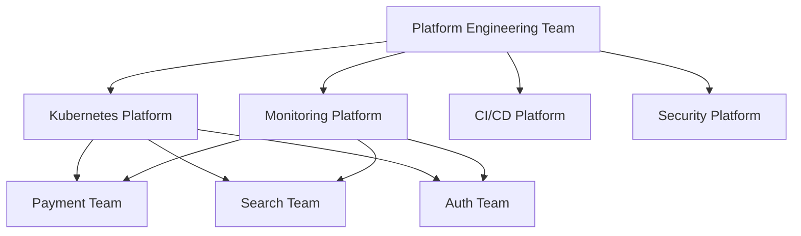
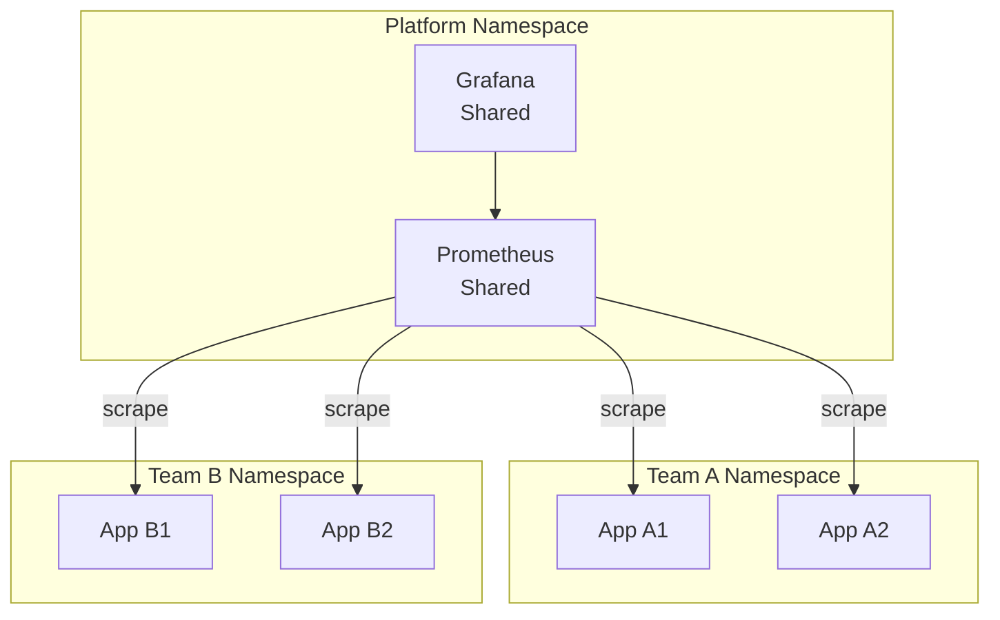
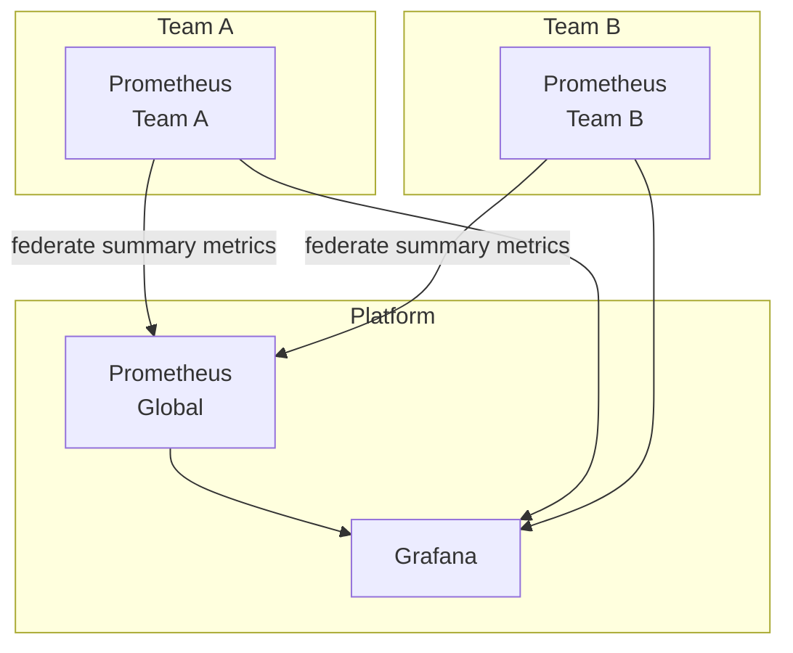
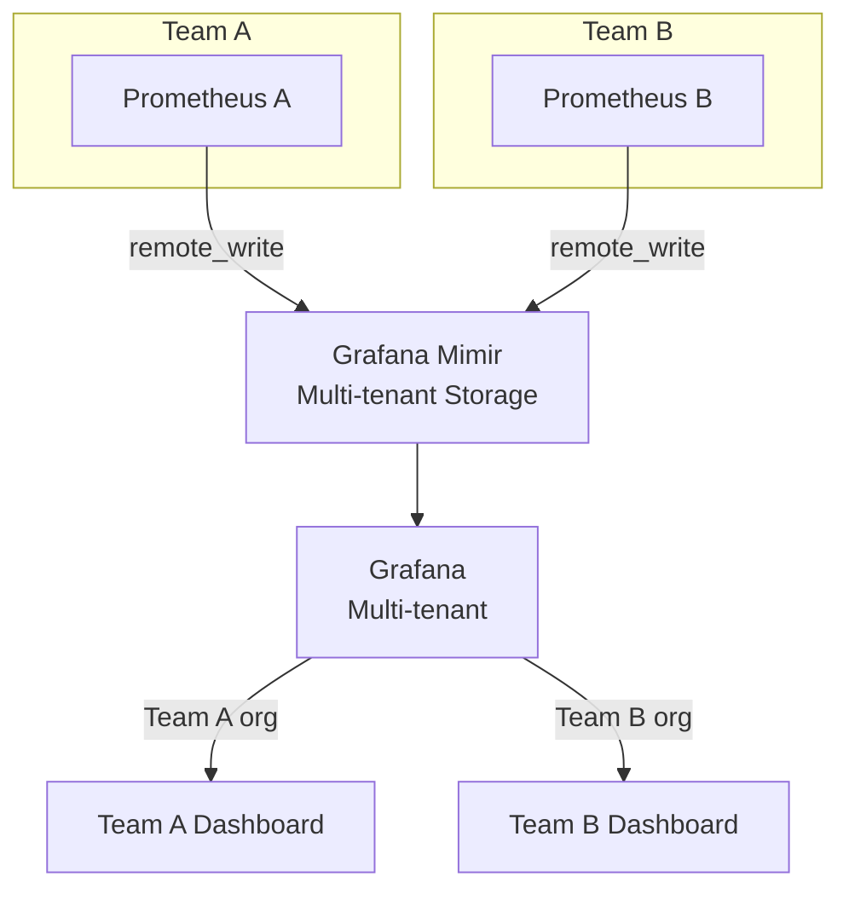

# Monitoring for Platform Engineering Teams

---

## What is Platform Engineering?

Platform Engineering teams build and operate internal developer platforms (IDPs) — the infrastructure, tooling, and services that other engineering teams use to build and deploy their products.

Think of a Platform Team as an **internal AWS** — they provide managed services so product teams can focus on business logic.



---

## Platform Monitoring Responsibilities

Platform teams have **two monitoring responsibilities**:

### 1. Monitor the Platform Itself
Ensure the infrastructure services that other teams depend on are healthy.

**Platform services to monitor:**
- Kubernetes control plane (API server, etcd, scheduler, controller manager)
- Internal load balancers
- Service mesh (Istio, Linkerd)
- Container registry
- Artifact storage
- Secrets management (Vault)
- Database provisioning service

### 2. Provide Monitoring as a Service
Give product teams the tools and guidance to monitor their own services.

---

## Multi-Tenant Monitoring Architecture

Platform teams often run **shared Prometheus and Grafana** for multiple teams.

### Option 1: Shared Prometheus



**Pros:** Simple, centralized
**Cons:** Single point of failure, resource contention, noisy neighbor

### Option 2: Federated Prometheus



**Pros:** Team autonomy, isolated failure domains
**Cons:** More complex, higher resource usage

### Option 3: Grafana Mimir / Thanos (Recommended at Scale)

For large organizations with 10+ teams, use long-term storage with multi-tenancy:



---

## Grafana Organizations for Multi-Tenancy

Grafana supports multiple **organizations** — each team gets their own isolated workspace:

```
Organization: Platform Team
  ├── Dashboards: Kubernetes cluster overview, etcd health
  └── Alerts: Platform-level alerts

Organization: Payment Team
  ├── Dashboards: Payment service metrics, transaction rates
  └── Alerts: Payment-specific alerts

Organization: Search Team
  ├── Dashboards: Search query performance, index health
  └── Alerts: Search-specific alerts
```

**Key Grafana RBAC roles for platform teams:**

| Role | Permission | Who Gets It |
|------|-----------|-------------|
| Admin | Full control | Platform team |
| Editor | Create/edit dashboards | Team leads |
| Viewer | View only | Team members |

---

## Platform SLOs vs Application SLOs

Platform teams track **infrastructure SLOs** that feed into application SLOs.

```
Platform SLO: Kubernetes API server availability > 99.99%
  ↓ (when API server is down, deployments fail)
Application SLO: Deployment success rate > 99%
  ↓ (when deployments fail, releases are delayed)
Business Impact: Feature release velocity decreases
```

**Platform SLOs to define:**

| Service | SLI | Target |
|---------|-----|--------|
| Kubernetes API | Availability | 99.99% |
| Internal DNS | Query success rate | 99.999% |
| Container registry | Pull success rate | 99.9% |
| CI/CD pipeline | Job success rate | 95% |
| Load balancer | Request success rate | 99.99% |

---

## Golden Paths for Monitoring

Platform teams should create **golden paths** — opinionated, pre-built monitoring setups that teams can adopt without expertise.

### Golden Path: Service Monitoring Template

```yaml
# ServiceMonitor template for teams to use
apiVersion: monitoring.coreos.com/v1
kind: ServiceMonitor
metadata:
  name: {{ .ServiceName }}-monitor
  namespace: {{ .TeamNamespace }}
  labels:
    team: {{ .TeamName }}
spec:
  selector:
    matchLabels:
      app: {{ .ServiceName }}
  endpoints:
    - port: metrics
      interval: 15s
      path: /metrics
```

### Golden Path: Default Dashboard

Platform teams create default dashboard templates that auto-populate for any new service:

```
Default Service Dashboard:
  Row 1: RED metrics (Rate, Errors, Duration)
  Row 2: Resource usage (CPU, Memory)
  Row 3: Kubernetes pod health
  Row 4: Downstream dependencies
```

Teams use this dashboard immediately after deploying a new service, without any dashboard creation work.

### Golden Path: Default Alerts

```yaml
# Platform provides default alert rules for all services
# Teams can override or extend

- alert: ServiceDown
  expr: up{namespace="{{ .Namespace }}"} == 0
  for: 2m
  severity: critical

- alert: HighErrorRate
  expr: |
    rate(http_requests_total{namespace="{{ .Namespace }}", status=~"5.."}[5m])
    / rate(http_requests_total{namespace="{{ .Namespace }}"}[5m]) > 0.01
  for: 5m
  severity: warning
```

---

## Chargeback and Cost Attribution

Platform teams often need to show each team their resource usage and cost.

**Using Prometheus labels for cost attribution:**

```promql
# CPU cost by team (using $0.048/CPU-hour as example)
sum(
  rate(container_cpu_usage_seconds_total[1h])
  * on(pod, namespace) group_left(label_team)
  kube_pod_labels
) by (label_team) * 0.048 * 720  # hours in a month
```

This enables **team-level infrastructure cost reports** from Grafana, shown to each team in their organization.

---

## Platform Engineering Monitoring Checklist

```
Infrastructure Layer:
  ☐ Kubernetes node health (CPU, memory, disk, network)
  ☐ etcd health (latency, DB size, leader elections)
  ☐ API server latency and error rate
  ☐ Scheduler and controller manager health
  ☐ Container network (CNI plugin health)

Service Layer:
  ☐ Internal load balancer health
  ☐ Ingress controller (Nginx, Traefik)
  ☐ Service mesh health (if applicable)
  ☐ Certificate expiry monitoring

Data Layer:
  ☐ Persistent volume usage
  ☐ Storage class performance
  ☐ Database operator health

Developer Platform:
  ☐ CI/CD pipeline success rate
  ☐ Container registry availability
  ☐ Artifact storage usage
  ☐ Developer portal uptime
```

---

## Key Takeaways

- ✅ Platform teams monitor the platform AND provide monitoring-as-a-service to product teams
- ✅ Multi-tenant Grafana (organizations + RBAC) isolates teams while sharing infrastructure
- ✅ Golden paths for monitoring reduce the burden on product teams
- ✅ Platform SLOs are upstream dependencies for application SLOs
- ✅ Cost attribution via Prometheus labels enables chargeback reporting

---

[← Monitoring for SRE](08-monitoring-for-sre.md) | [Next Section: Monitoring Fundamentals →](../02-monitoring-fundamentals/README.md)
