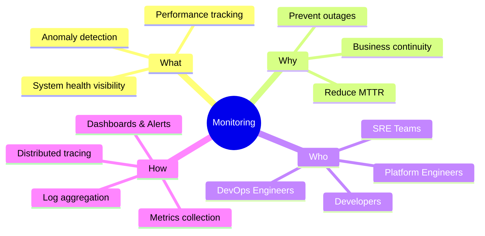

# Section 1 — Introduction to Monitoring

> **Level:** Absolute Beginner | **Time:** ~2 hours | **Prerequisites:** None

---

## 📖 What You'll Learn

By the end of this section, you will understand:
- What monitoring is and why every system needs it
- The history of monitoring from the mainframe era to cloud-native
- The difference between monitoring and observability
- The business case for investing in monitoring
- How monitoring applies to DevOps, SRE, and Platform Engineering teams

---

## 📚 Topics in This Section

| # | Topic | Description |
|---|-------|-------------|
| 1 | [What is Monitoring?](01-what-is-monitoring.md) | Core concepts and definitions |
| 2 | [Why Monitoring Matters](02-why-monitoring-matters.md) | Real costs of poor monitoring |
| 3 | [History of Monitoring](03-history-of-monitoring.md) | Evolution from SNMP to cloud-native |
| 4 | [Monitoring vs Observability](04-monitoring-vs-observability.md) | Understanding the difference |
| 5 | [Business Impact](05-business-impact.md) | Quantifying monitoring ROI |
| 6 | [Monitoring in Cloud Environments](06-monitoring-in-cloud.md) | Cloud-native monitoring challenges |
| 7 | [Monitoring for DevOps Teams](07-monitoring-for-devops.md) | DevOps-specific use cases |
| 8 | [Monitoring for SRE Teams](08-monitoring-for-sre.md) | SRE practices and monitoring |
| 9 | [Monitoring for Platform Engineering](09-monitoring-for-platform-engineering.md) | Platform-level monitoring strategy |

---

## 🏁 Quick Summary

---

## ➡️ Next Section

[Section 2 — Monitoring Fundamentals →](../02-monitoring-fundamentals/README.md)
