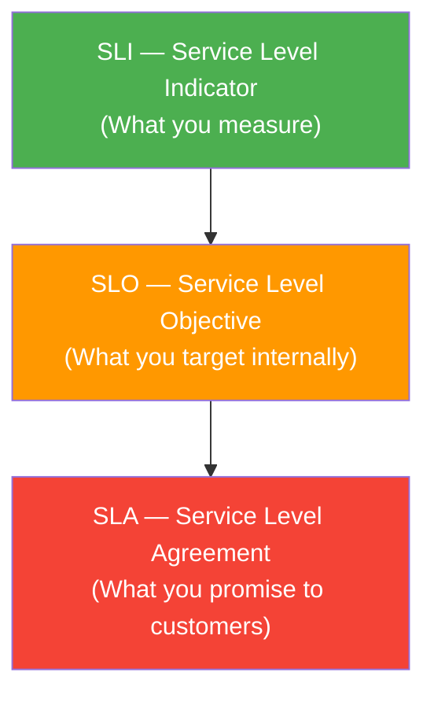

# SLIs, SLOs, and SLAs

> The reliability contract: from measurement to promise.

---

## The Three-Level Framework



They're nested: SLAs are based on SLOs, which are based on SLIs.

---

## SLI — Service Level Indicator

An SLI is a **carefully defined quantitative measure** of some aspect of your service.

### Good SLIs

SLIs should measure what users care about:

| User Experience | SLI |
|----------------|-----|
| "The site is up" | `fraction of successful HTTP requests` |
| "It's fast" | `fraction of requests served in < 200ms` |
| "My data is safe" | `fraction of write requests durably persisted` |
| "Payments work" | `fraction of payment transactions completed successfully` |

### Defining SLIs Precisely

A good SLI has a precise definition:

```
SLI: Availability

Numerator:   Number of HTTP requests returning status 200-499
             (non-5xx, because 4xx are client errors, not our fault)
             
Denominator: Total number of HTTP requests

Window:      Rolling 30 days

Measurement: Prometheus metrics from load balancer
             (not from the service itself — to catch cases where 
             the service is unreachable)
```

### Common SLIs by Service Type

**HTTP API:**
```
Availability = successful requests / total requests
Latency = fraction of requests < threshold
Correctness = fraction of requests returning expected response
```

**Data Pipeline:**
```
Freshness = fraction of pipeline runs completing within SLA window
Completeness = fraction of expected records processed
Accuracy = fraction of output records matching expected values
```

**Storage:**
```
Durability = fraction of writes that can be read back
Availability = fraction of read operations returning data
Throughput = fraction of time meeting min throughput requirements
```

---

## SLO — Service Level Objective

An SLO is a **target value** for an SLI that you commit to internally.

### Setting SLO Targets

```
SLI: Availability (fraction of successful requests)
SLO: 99.9% over a rolling 30-day window
```

This means: In any 30-day period, at most **0.1%** of requests can fail.

### SLO Math

```
SLO: 99.9% availability
Error Budget: 100% - 99.9% = 0.1% of requests can fail

In a month with 1,000,000 total requests:
Allowed failures: 1,000,000 × 0.001 = 1,000 requests

If you serve 100 requests/minute:
1,000 failed requests / 100 requests per minute = 10 minutes of total outage allowed
```

### How to Choose SLO Targets

Don't start with 99.999%. Start with what's achievable based on historical data.

```
Step 1: Look at your actual historical availability
        "We've been at 99.3% for the last 6 months"

Step 2: Set an achievable but meaningful target
        "Our SLO is 99.5% — better than history but achievable"

Step 3: Measure against it for 3 months
        "We hit 99.7% — we can raise the SLO"

Step 4: Iterate toward the right level
        Never set SLOs tighter than you can reliably achieve
```

**SLO Targets by Tier:**

| Tier | SLO | Max Monthly Downtime |
|------|-----|---------------------|
| Best effort | 99% | 7.2 hours |
| Standard | 99.5% | 3.6 hours |
| Professional | 99.9% | 43.2 minutes |
| Enterprise | 99.95% | 21.6 minutes |
| Critical | 99.99% | 4.3 minutes |
| Extreme | 99.999% | 26 seconds |

### SLO Tracking in Prometheus

```promql
# Current SLO compliance (last 30 days)
-- Availability --
avg_over_time(
  (
    sum(rate(http_requests_total{status!~"5.."}[5m]))
    /
    sum(rate(http_requests_total[5m]))
  )[30d:5m]
)

-- Latency --
avg_over_time(
  (
    sum(rate(http_request_duration_seconds_bucket{le="0.2"}[5m]))
    /
    sum(rate(http_request_duration_seconds_count[5m]))
  )[30d:5m]
)
```

### Grafana SLO Dashboard

Your SLO dashboard should show:

```
┌─────────────────────────────────────────────────────┐
│  SERVICE: User API                    Period: 30 days │
├──────────────────┬──────────────────┬────────────────┤
│  Availability    │  Latency SLO     │  Error Budget  │
│  99.97%          │  99.8%           │  70% remaining │
│  Target: 99.9%   │  Target: 99.5%   │                │
│  ✅ OK           │  ✅ OK           │  🟢 Healthy    │
├──────────────────┴──────────────────┴────────────────┤
│  Availability over last 30 days [graph]              │
│  ~~~~~~~~~~~~~~~~~~~~~~~~~~~~~~~~~~~~                │
├──────────────────────────────────────────────────────┤
│  Error rate over last 30 days [graph]               │
│  ~~~~~~~~~~~~~~~~~~~~~~~~~~~~~~~~~~~~                │
└──────────────────────────────────────────────────────┘
```

---

## SLA — Service Level Agreement

An SLA is a **formal contract** between a service provider and a customer, with defined consequences for violations.

### SLA vs SLO Relationship

```
Internal SLO: 99.9% availability

External SLA: 99.5% availability
              (SLA is looser than SLO — gives buffer for SLO violations
               that don't breach the customer's SLA)
```

**Why set SLAs looser than SLOs:**
- SLOs are your operational target (what you aim for internally)
- SLAs are your commercial commitment (what you're contractually liable for)
- The gap between them is your "reliability buffer" — prevents SLO violations from immediately becoming SLA violations with financial consequences

### Typical SLA Components

```
1. Uptime Commitment
   "Service will be available 99.9% of the time per calendar month"

2. Performance Commitment
   "API response time will not exceed 500ms at p99"

3. Measurement Method
   "Measured by our synthetic monitoring from 3 global locations"

4. Exclusions
   "Excludes scheduled maintenance, force majeure, customer-caused issues"

5. Remedies (Service Credits)
   99.0% - 99.9%:  10% service credit
   95.0% - 99.0%:  25% service credit
   Below 95.0%:    50% service credit
```

### Common SLA Mistakes

| Mistake | Problem | Fix |
|---------|---------|-----|
| SLA tighter than SLO | No buffer — any SLO violation = SLA violation | Set SLA at least 0.5 nines below SLO |
| No measurement method defined | Customer disputes when "downtime" occurred | Define exactly how availability is measured |
| No exclusions | You're liable for things outside your control | Define force majeure and customer-caused exclusions |
| Untested remedies | Service credits that are too high bankrupt you | Model financial exposure at different violation levels |

---

## Connecting SLIs, SLOs, and SLAs to Prometheus

### Complete Example: E-Commerce Checkout API

```yaml
# 1. SLI definition (what we measure)
# Availability: HTTP 200-499 / total HTTP requests to /api/checkout
# Latency: fraction of requests < 1s

# 2. SLO (what we target)
# Availability: 99.95% over rolling 30 days
# Latency: 99.5% of requests < 1s over rolling 30 days

# 3. SLA (what we promise customers)
# Availability: 99.9% over calendar month
# Latency: not committed (internal SLO only)

# 4. Alert rules based on SLO
groups:
  - name: checkout-slos
    rules:
      # Alert when error budget burning too fast
      - alert: CheckoutSLOBudgetBurning
        expr: |
          (
            1 - (
              sum(rate(http_requests_total{service="checkout", status!~"5.."}[1h]))
              / sum(rate(http_requests_total{service="checkout"}[1h]))
            )
          ) > (0.0005 * 14.4)  # 14.4x burn rate
        for: 2m
        labels:
          severity: critical
          service: checkout
        annotations:
          summary: "Checkout SLO error budget burning at 14.4x rate"
          runbook: "https://wiki/runbooks/checkout-slo"
```

---

## Key Takeaways

- ✅ SLI = what you measure (e.g., availability fraction)
- ✅ SLO = what you target internally (e.g., 99.9%)
- ✅ SLA = what you promise contractually (e.g., 99.5%, with credits)
- ✅ SLAs should be looser than SLOs to provide a buffer
- ✅ Track SLIs with Prometheus, visualize SLO compliance in Grafana
- ✅ Start with achievable SLO targets, tighten over time

---

[← Alerts](06-alerts.md) | [Next: MTTR & MTTD →](08-mttr-mttd.md)
