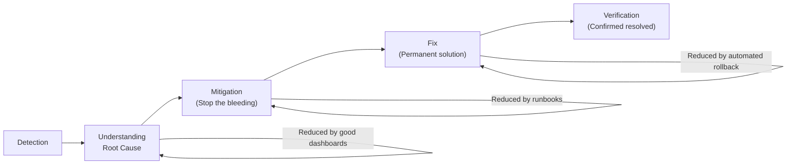

# MTTR and MTTD

---

## MTTD — Mean Time to Detect

**MTTD** is the average time between when a problem starts and when your team knows about it.

```
Timeline:
  14:00 — Problem begins (CPU leak starts)
  14:17 — Prometheus alert fires
  14:17 — On-call engineer receives PagerDuty notification

MTTD = 17 minutes
```

### What Affects MTTD?

| Factor | Impact |
|--------|--------|
| Scrape interval | Shorter = faster detection |
| Alert evaluation interval | Shorter = faster alerting |
| Alert `for` duration | Longer = slower but fewer false positives |
| Alert coverage | Missing alert rules = infinite MTTD for that problem |
| Alert routing speed | PagerDuty vs email vs phone |

### Optimizing MTTD

```yaml
# prometheus.yml — scrape every 15s for faster detection
global:
  scrape_interval: 15s
  evaluation_interval: 15s

# Alert rule — use short 'for' durations for critical alerts
- alert: ServiceDown
  expr: up == 0
  for: 1m      # Only wait 1 minute to confirm down (not 5m)
  labels:
    severity: critical
```

**Industry benchmarks:**
- Poor: > 30 minutes
- Average: 10-30 minutes
- Good: 2-10 minutes
- Excellent: < 2 minutes (only achievable with comprehensive alerting)

---

## MTTR — Mean Time to Recover

**MTTR** is the average time from detection to full service restoration.

```
14:17 — Alert fires (detection)
14:19 — Engineer opens Grafana dashboard
14:24 — Root cause identified (OOM error in logs + memory metric spike)
14:31 — Fix deployed (memory leak fix)
14:33 — Service healthy again

MTTR = 14:33 - 14:17 = 16 minutes
```

### The MTTR Components



### What Reduces MTTR

| Tool/Practice | Impact on MTTR |
|---------------|---------------|
| Grafana dashboards | -40%: Visual diagnosis vs manual log trawling |
| Runbooks | -25%: Step-by-step resolution guides |
| Alert annotations (with dashboard links) | -15%: Jump directly to relevant dashboard |
| Auto-remediation | -80%: For known issues with automated fixes |
| Post-incident practice | -10% each major incident: team gets faster |

---

## Other Related Metrics

### MTTF — Mean Time to Failure
Average time a system runs before failing. Higher is better.

### MTBF — Mean Time Between Failures
Average time between the end of one incident and the start of the next.

```
MTBF = MTTF + MTTR

If your service fails for 10 minutes every 100 hours:
MTTF = 100 hours
MTTR = 10 minutes
MTBF ≈ 100 hours 10 minutes
```

### Availability from MTBF

```
Availability = MTTF / (MTTF + MTTR)

Example:
MTTF = 100 hours = 6000 minutes
MTTR = 10 minutes
Availability = 6000 / 6010 = 99.83%
```

---

## Measuring MTTR/MTTD in Grafana

### Using Alertmanager Data

```promql
# Average time alerts were firing (proxy for MTTR)
avg(
  alertmanager_alerts_resolved_total - alertmanager_alerts_firing_total
)
```

### Better: Use Incident Tracking Integration

Most teams use PagerDuty or OpsGenie, which track:
- Incident created time (= detection time)
- Incident resolved time (= recovery time)
- MTTR calculated automatically

Grafana has PagerDuty and OpsGenie data source plugins for visualizing this data.

---

## Key Takeaways

- ✅ MTTD: How fast you detect problems (target: < 5 minutes with good alerting)
- ✅ MTTR: How fast you recover (target: < 30 minutes with good dashboards + runbooks)
- ✅ Both are directly improved by Prometheus alerts and Grafana dashboards
- ✅ Track these metrics over time — improvement shows your monitoring investment paying off

---

[← SLI/SLO/SLA](07-sli-slo-sla.md) | [Next: Error Budgets →](09-error-budgets.md)
