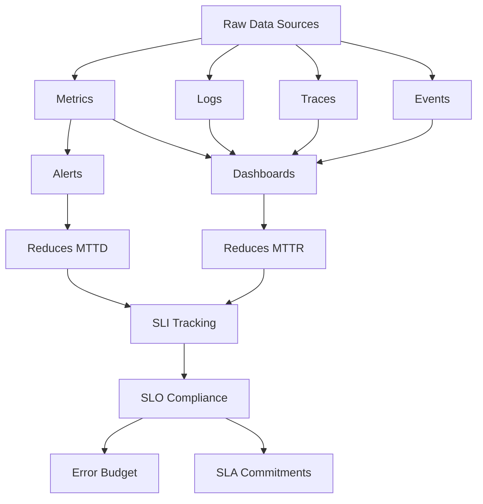

# Section 2 — Monitoring Fundamentals

> **Level:** Beginner | **Time:** ~3 hours | **Prerequisites:** [Section 1](../01-introduction-to-monitoring/README.md)

---

## 📖 What You'll Learn

The core building blocks of monitoring. These concepts apply to every monitoring system — from Nagios to Prometheus to Datadog. Master these, and any tool becomes accessible.

---

## 📚 Topics in This Section

| # | Topic | Key Concept |
|---|-------|-------------|
| 1 | [Metrics](01-metrics.md) | Numerical measurements over time |
| 2 | [Logs](02-logs.md) | Discrete event records |
| 3 | [Traces](03-traces.md) | Request flow through services |
| 4 | [Events](04-events.md) | Significant occurrences |
| 5 | [Dashboards](05-dashboards.md) | Visual representation of data |
| 6 | [Alerts](06-alerts.md) | Automated notification of problems |
| 7 | [SLIs, SLOs, SLAs](07-sli-slo-sla.md) | Reliability measurement and commitment |
| 8 | [MTTR & MTTD](08-mttr-mttd.md) | Incident response metrics |
| 9 | [Error Budgets](09-error-budgets.md) | Balancing reliability and velocity |

---

## 🗺️ How These Concepts Relate

---

## ➡️ Next Section
[Section 3 — Monitoring Tool Landscape →](../03-tool-landscape/README.md)
